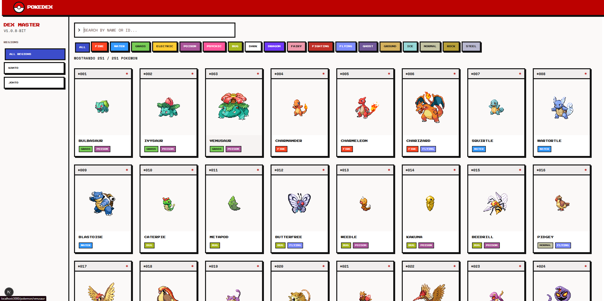
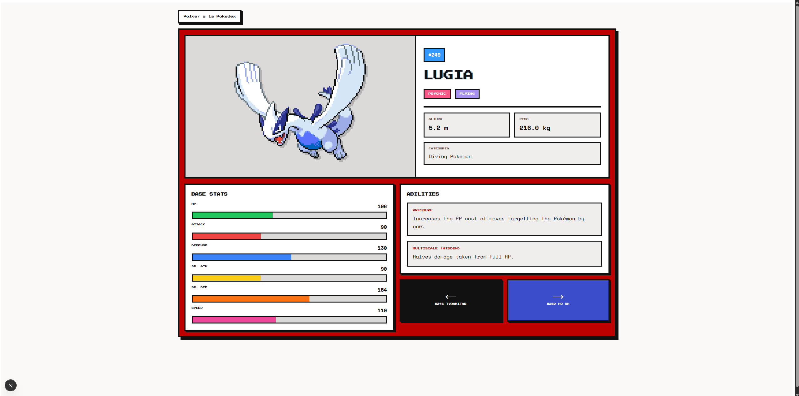

# PokedexIA

Pokedex interactiva construida con `Next.js`, `TypeScript` y `PokeAPI`, con una interfaz inspirada en estetica 8-bit para explorar Pokemon de `Kanto` y `Johto`.

## Vista General

PokedexIA es un proyecto orientado a portfolio que combina consumo real de datos desde `PokeAPI` con una UI retro personalizada.

Actualmente permite:

- Explorar `251` Pokemon de `Kanto` y `Johto`
- Buscar por nombre o ID
- Filtrar por tipo
- Filtrar por region
- Consultar una vista de detalle con stats, abilities y navegacion entre Pokemon
- Preguntar en lenguaje natural a un chat que responde con los datos reales del catalogo

## Demo Visual

### Home



### Detalle



## Features

- Home con estilo 8-bit y navegacion visual retro
- Busqueda por nombre o ID en tiempo real
- Filtros por tipo Pokemon
- Filtro lateral por regiones `Kanto` y `Johto`
- Tarjetas con sprites clasicos y tipos reales
- Vista de detalle con:
  - categoria del Pokemon
  - tipos
  - stats base con barras de color
  - abilities con descripcion real desde `PokeAPI`
  - navegacion entre Pokemon anterior y siguiente
- Chat conversacional (RAG) sobre los `251` Pokemon:
  - responde en lenguaje natural a partir de los datos reales de `PokeAPI`, no de conocimiento del modelo
  - resuelve preguntas de superlativo (`el mas pesado de Johto`) ordenando el catalogo completo, no solo las fichas mas parecidas a la pregunta
  - muestra que Pokemon ha consultado para elaborar cada respuesta
  - limitacion de tasa por IP y manejo de errores del proveedor
- Generacion estatica con revalidacion para reducir llamadas repetidas

## Stack Tecnico

- `Next.js 16`
- `React 19`
- `TypeScript`
- `Axios`
- `PokeAPI`
- `CSS Modules`
- `next/font/google`
- `Gemini API` (`gemini-embedding-001` y `gemini-3.5-flash-lite`) para el chat

## Estructura Del Proyecto

```txt
pages/
  index.tsx                 Home con filtros y listado principal
  pokemon/[name].tsx        Vista de detalle de cada Pokemon
  api/chat.ts               Endpoint del chat conversacional
components/
  PokemonCard.tsx           Tarjeta reutilizable del listado
  PokedexChat.tsx           Asistente conversacional de la home
lib/
  axios.ts                  Cliente HTTP base para PokeAPI
  gemini.ts                 Cliente de la API de Gemini (solo servidor)
  semanticSearch.ts         Busqueda por similitud sobre el corpus
  chatPrompt.ts             Validacion de la pregunta y armado del prompt
  structuredQuery.ts        Consultas de superlativo sobre el catalogo completo
  rateLimit.ts              Limitacion de tasa por IP
scripts/
  build-pokedex-corpus.ts   Genera el corpus de embeddings
data/
  pokedex-corpus.json       Corpus vectorizado de los 251 Pokemon
types/
  pokemon.ts                Tipos principales de datos
docs/
  *.md                      Documentacion tecnica y cambios por feature
```

## Instalacion

```bash
npm install
```

## Variables De Entorno

El chat conversacional requiere una clave de la API de Gemini. Copia `.env.example` a `.env.local` y rellena el valor:

```bash
GEMINI_API_KEY=tu_clave
```

La clave se obtiene en [Google AI Studio](https://aistudio.google.com/apikey) y el nivel gratuito basta para el uso de este proyecto. Nunca debe versionarse ni exponerse con el prefijo `NEXT_PUBLIC_`: solo se usa en codigo de servidor.

El resto de la aplicacion funciona sin esta variable; unicamente el chat quedaria inoperativo.

## Uso Local

Inicia el entorno de desarrollo:

```bash
npm run dev
```

Abre en el navegador:

```txt
http://localhost:3000
```

Ejemplo de pagina de detalle:

```txt
http://localhost:3000/pokemon/charizard
```

## Scripts Disponibles

```bash
npm run dev
npm run build
npm run start
npm run lint
npm run test           # pruebas de la logica de servidor
npm run build:corpus   # regenera el corpus de embeddings del chat
```

`build:corpus` solo hace falta si cambian los datos de origen o el texto de las fichas. Tarda unos 3 minutos, porque el nivel gratuito de Gemini limita a 100 embeddings por minuto.

## Fuente De Datos

Este proyecto consume datos desde la API publica oficial no comercial:

- `https://pokeapi.co/api/v2/`

Recursos usados en la aplicacion:

- `pokemon`
- `pokemon-species`
- `ability`

## Decisiones Tecnicas Relevantes

- La aplicacion usa `pages/` router de Next.js.
- El detalle de cada Pokemon se genera con `getStaticPaths` y `getStaticProps`.
- La home usa `getStaticProps` y revalida periodicamente.
- `next/image` esta configurado con `images.unoptimized = true` para evitar problemas de timeout con sprites remotos.
- La region actual se calcula por rango de ID para el alcance actual:
  - `1-151`: `Kanto`
  - `152-251`: `Johto`
- El chat usa RAG con embeddings precalculados en `data/pokedex-corpus.json`, no una base de datos vectorial: con `251` fichas fijas, la similitud coseno en memoria cuesta milisegundos y evita infraestructura innecesaria.
- La clave de Gemini solo se usa en `pages/api/chat.ts` y en el script del corpus, nunca en codigo de cliente.
- Justificacion completa de estas decisiones en [`docs/ia-decision.md`](docs/ia-decision.md).

## Roadmap

- Anadir mas regiones y generaciones
- Mejorar el acceso al filtro de regiones en movil
- Optimizar la carga de datos de la home si aumenta el numero de generaciones
- Anadir favoritos o comparador de Pokemon

## Creditos

- Datos: [PokeAPI](https://pokeapi.co/)
- Franquicia Pokemon: Nintendo / Creatures / Game Freak

## Licencia

Este proyecto se distribuye bajo licencia `MIT`. Consulta el archivo [LICENSE](LICENSE).
